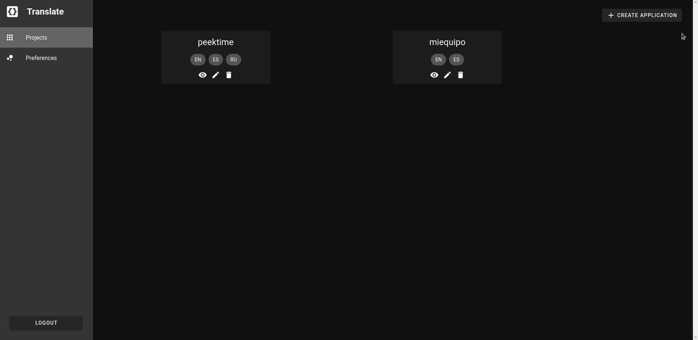

# template

<!-- ABOUT THE PROJECT -->
## Translate

 / 

Create translation files for your application, add languages, and set up your sections and labels with the translations that you need, all using an intuitive and easy to use interface.
Generate a json file with the translation for each language, download or use them directly from the application storage.

### Built With

* [Vuetify](https://vuetifyjs.com/)
* [Nuxt](https://nuxtjs.org/)
* [Scalars](https://console.scalars.co/)
* [GraphQL](https://graphql.org/)
* [Apollo](https://www.apollographql.com/)
* [Amplify](https://aws.amazon.com/es/amplify/)

### Prerequisites

You need an account to use the application. Since this is a beta version, if you want one, you'll need to contact contacto@madrov.com

### Installation

```bash
# install dependencies
$ yarn install

# serve with hot reload at localhost:3000
$ yarn dev

# build for production and launch server
$ yarn build
$ yarn start

# generate static project
$ yarn generate
```

For detailed explanation on how things work, check out [Nuxt.js docs](https://nuxtjs.org).

<!-- CONTACT -->
## Contact

[Madrov SAS](https://madrov.com/) - contacto@madrov.com

Project Link: [https://devtranslate.madrov.com/](https://devtranslate.madrov.com/)
